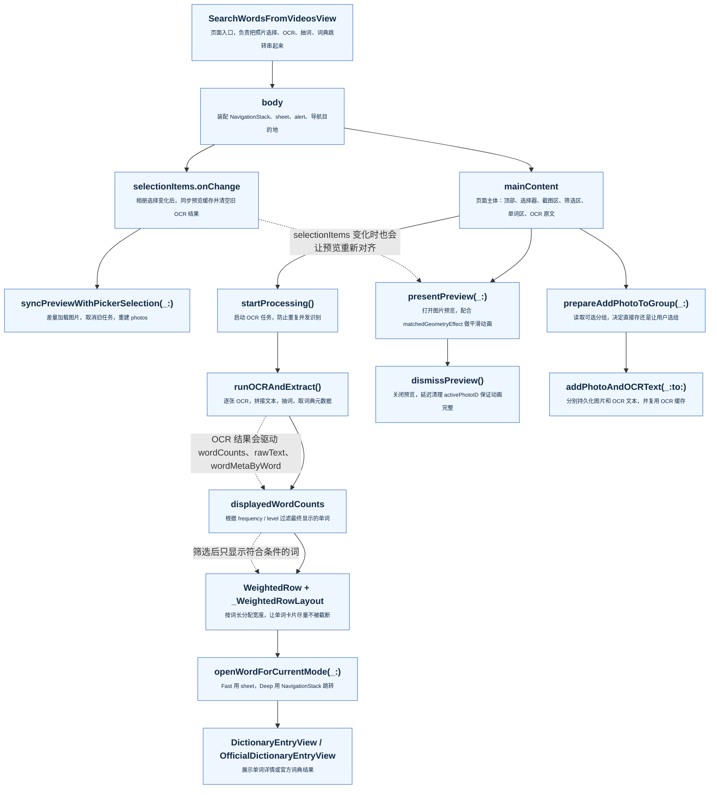

# SearchWordsFromVideosView

`SearchWordsFromVideosView` 是一个 SwiftUI 页面，用来从相册里选择截图，做 OCR，抽取英文单词，并把结果送去词典或分组管理。

这份说明按“先看全局，再看局部”的方式组织，方便初学者先建立框架，再去看具体函数。

## 一眼看懂的主流程

## 代码是怎么跑的

### 1. 页面先被装配出来

`body` 创建 `NavigationStack(path: $wordNavigationPath)`，然后把 `mainContent` 放进去。  
这一层还同时挂了几个系统级监听：

- `onAppear`：刷新相册权限状态
- `onChange(selectionItems)`：相册选择变化后同步预览和 OCR 派生状态
- `onChange(frequencyMin / frequencyMax / levelMin / levelMax)`：保证筛选上下限不会互相越界
- `navigationDestination(for: String.self)`：把单词跳到 `DictionaryEntryView`
- `sheet`：控制词典页、设置页、分组选择页
- `alert`：处理权限不足、没有分组等提示

### 2. 用户先选截图，再进入 OCR 主线

选择截图后，最关键的是这条链：

`selectionItems` -> `syncPreviewWithPickerSelection(_:)` -> `photos`

这里的设计重点是：

- `selectionItems` 是唯一权威来源
- `photos` 只是为了本地预览而缓存的 `UIImage`
- 只要相册选项变了，旧 OCR 结果就会被清空，避免新旧截图混在一起

当用户点击“开始识别并抽词”后：

`startProcessing()` -> `runOCRAndExtract()`

`runOCRAndExtract()` 会：

- 先把 `isProcessing` 打开
- 逐张对 `photos` 里的图片做 OCR
- 把识别结果按截图顺序拼接
- 调 `WordExtractor.extractWords(from:)` 提取词汇
- 调 `buildOrderedUniqueList(from:counts:)` 去重并保留首次出现顺序
- 再向 `dictionaryService` 请求词频和等级元数据
- 最后把 `wordMetaByWord` 和 `isWordMetaReady` 更新回主线程

### 3. 单词展示不是直接画出来的，而是先过滤

`displayedWordCounts` 是一个派生属性，它不会自己制造数据，只负责“挑选可以展示的词”。

它依赖：

- `wordCounts`
- `wordMetaByWord`
- `filterType`
- `frequencyMin / frequencyMax`
- `levelMin / levelMax`

所以屏幕上看到的词，其实是“识别结果 + 词典元数据 + 当前筛选条件”的组合产物。

### 4. 预览、分组、词典是三条支线

- 图片点击后走 `presentPreview(_:)` 和 `dismissPreview()`
- 长按或上下文菜单里“添加到组”走 `prepareAddPhotoToGroup(_:)`
- 单词点击后走 `openWordForCurrentMode(_:)`

其中：

- `Fast` 模式打开官方词典 sheet
- `Deep` 模式把单词压入 `NavigationStack`，进入更深层详情页

### 5. 这个页面最重要的并发约束

这个文件里有两个长期任务：

- `loadTask`
- `processingTask`

它们分别负责：

- 图片加载
- OCR + 抽词

为了避免旧任务污染新状态，代码里会在关键节点主动 `cancel()`。

另外还有一个很重要的主线程原则：

- 访问和更新 SwiftUI 状态时尽量回到 `MainActor`
- 真正耗时的 OCR、元数据拉取尽量放在异步任务里

## 关键函数速查

| 函数 / 组件 | 作用 |
| --- | --- |
| `PickedPhoto` | 把 `PhotosPickerItem` 和 `UIImage` 绑在一起，方便预览和删除 |
| `presentPreview(_:)` | 打开大图预览 |
| `dismissPreview()` | 关闭预览并保持动画连续 |
| `syncPreviewWithPickerSelection(_:)` | 根据最新选择重建本地图片缓存 |
| `startProcessing()` | 启动 OCR 任务 |
| `runOCRAndExtract()` | OCR、抽词、排序、取元数据 |
| `buildOrderedUniqueList(from:counts:)` | 去重并保留单词首次出现顺序 |
| `displayedWordCounts` | 根据筛选条件决定最终显示什么 |
| `openWordForCurrentMode(_:)` | 控制单词点击后的跳转方式 |
| `prepareAddPhotoToGroup(_:)` | 准备把截图存入分组 |
| `addPhotoAndOCRText(_:to:)` | 保存图片和 OCR 文本 |
| `WeightedRow` / `_WeightedRowLayout` | 单词卡片的加权布局 |

## 可以安全修改的地方

- UI 文案
- 按钮样式
- 预览动画的细节参数
- 筛选项的显示方式
- 单词卡片的视觉排版

## 需要谨慎修改的地方

- `selectionItems`、`photos`、`rawText`、`wordCounts` 这条状态链
- `runOCRAndExtract()` 里的取消逻辑
- `MainActor` 切换点
- `activePhotoID` 和 `matchedGeometryEffect` 的配合
- `displayedWordCounts` 的过滤规则

## 一句话总结

这个页面的核心不是“显示图片”，而是把“选图 -> 预览 -> OCR -> 抽词 -> 过滤 -> 词典跳转/分组保存”这条链路稳定地串起来。
